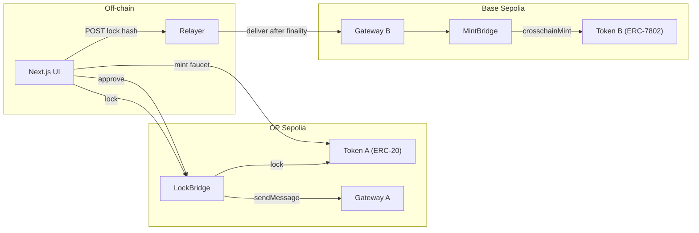
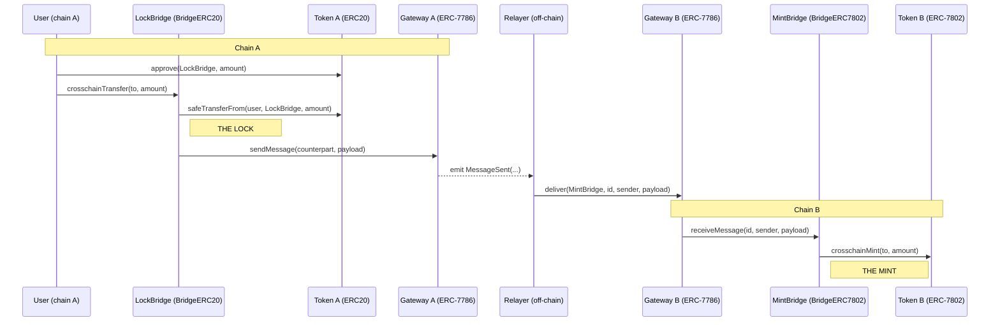
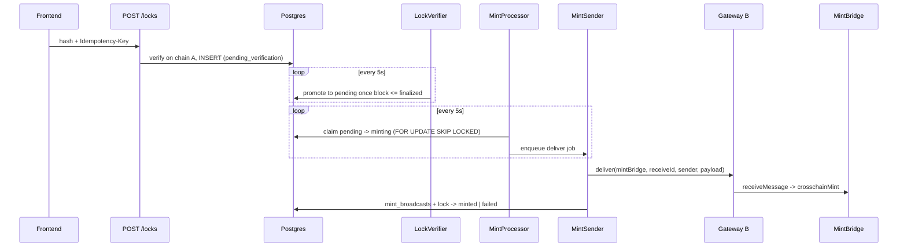

# Lock-and-mint bridge

A lock-and-mint token bridge between OP Sepolia (chain A) and Base Sepolia (chain B): lock Token A on OP Sepolia, receive the equivalent Token B on Base Sepolia. OP Sepolia and Base Sepolia are the two best-known OP-stack testnets.

## Tech Talk

### Components

- Contracts: an ERC-7786 gateway (send on A, deliver on B) and an ERC-7802 token on Base.
- Next.js UI: drives the full flow end to end.
- Relayer: verifies the lock, waits for finality, and delivers the message on Base.

### End-to-end flow

1. Mint Token A from the faucet.
2. Approve the bridge (skipped if the allowance is already enough).
3. Lock Token A through the bridge.
4. Relayer verifies the lock and waits for finality.
5. Relayer delivers the message on Base.
6. MintBridge mints Token B; the user receives it.

### Contract-level sequence

### Relayer pipeline

### Design decisions

- Finality: wait for the `finalized` block tag rather than `latest`, so a source-chain reorg cannot erase a lock we have already minted against. L1-backed and effectively irreversible, at the cost of a longer wait.
- Nonce safety: a single-writer signing pipeline for the relayer EOA on Base. One writer means nonces are never shared or reordered, with no distributed lock.
- Idempotency: `send_id` is the on-chain message id and the idempotency key. A `UNIQUE` constraint on `send_id`, plus reusing the same nonce on fee-bump replacements, keeps a single lock from ever minting twice.

## Improvements

### 1. Contract-side fee accounting and a minimum fee

Today the relayer relays for free and absorbs the destination gas, and gas prices vary. Charge a bridge fee at lock time in the contract, with a minimum-fee floor so a relay is never unprofitable during a gas spike. Optionally price destination gas via an oracle.

### 2. Gasless / sponsored transactions

Users must hold native ETH to transact today. Add ERC-4337 with a paymaster to sponsor gas or let users pay fees in the token they already hold, plus embedded wallets (e.g. Privy) for email/social onboarding.

- EIP-2612 permit enables a gasless approve (sign instead of send a separate approve tx). It does not make the lock itself gasless.
- Permit requires adding the ERC20Permit extension, since Token A is a plain ERC-20 today.
- Account abstraction also allows batching approve and lock into a single atomic operation, so both land together or not at all.

### 3. Indexer

The relayer only learns about locks the frontend POSTs to it. A user who locks through a script, or closes the tab before the POST, is never minted. An indexer scans the source chain for lock events and feeds the relayer directly, and also powers frontend recovery of pending mints. A chain with queryable on-chain storage reduces the need for this external indexer.

### 4. Recover an in-progress mint

Mint state is in memory today, so a reload or a return visit loses track of an in-flight mint. Two complementary parts:

- Persist `sendId` keyed by wallet in localStorage and re-poll the existing `GET /locks/:sendId` on load. This recovers same-browser reloads with no new endpoint.
- Add a `GET /locks?recipient=<address>` endpoint so the relayer DB is the durable source of truth across a different browser, a different device, or cleared storage.

A lock that never reached the relayer (tab closed before the POST) is only recovered by the indexer in improvement 3, so 3 and 4 compose.

### Further improvements

- Contracts:
  - Two-way bridge (burn on Base, unlock on OP Sepolia), currently one-way.
  - On-chain dedupe of `receiveId` as defense-in-depth beyond relayer-only idempotency.
  - Fuller test suite (unauthorized callers, wrong gateway, wrong counterpart) plus a security review.
  - `Ownable2Step` or a timelock for privileged setters.
- Relayer:
  - Trust-minimized minting: today the relayer is fully trusted and could mint Token B without a real lock ever happening. The destination should mint only against on-chain proof that the lock happened on OP Sepolia (a light-client / storage proof, or an optimistic proof backed by a bond), so a compromised relayer cannot mint unbacked tokens.
  - High availability: multiple instances, reworked nonce ownership.
  - A defined stuck-tx policy beyond the 2x fee-bump ladder (cancel-at-same-nonce, RPC failover, alerting).
  - Sequencer-health gating (uptime feeds, L1 force-inclusion fallback).
  - Idempotency and integration tests.
  - Signing-key hardening (KMS / Turnkey).
- Frontend:
  - Stuck source-tx handling: catch viem `TransactionReplacedError`, low-gas guidance.
  - Surface on-chain mint failures in the UI.
  - Detect insufficient ETH for gas up front.
  - Mobile responsiveness.
  - Number formatting and precision rules with tests.
- Cross-cutting:
  - CI/CD across all three projects (tests, lint, DB migrations).
  - Client-side observability (wallet errors, RPC failures, transaction success rates).
