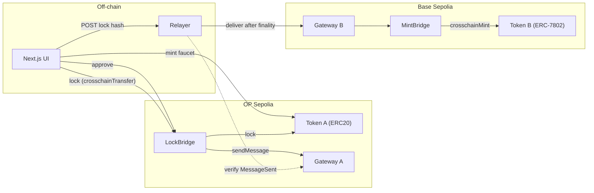
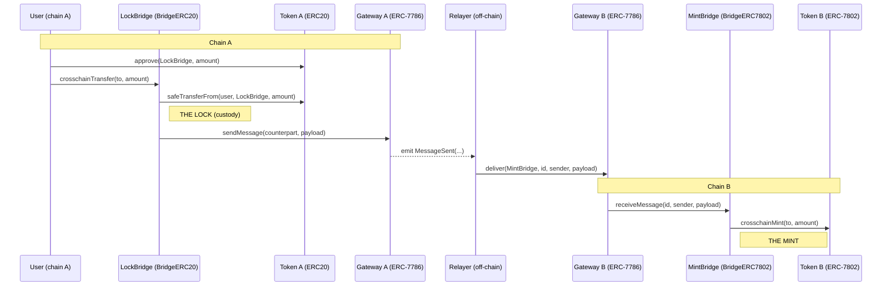
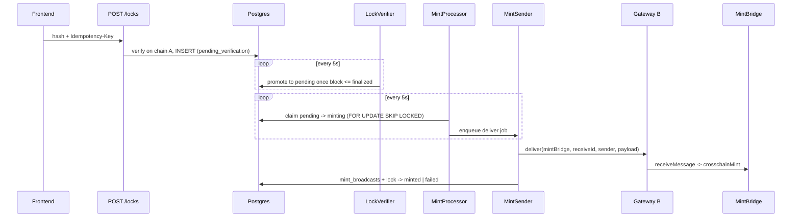
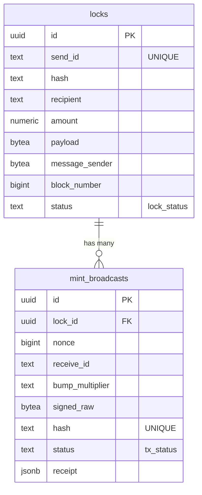

# Lock-and-mint bridge

A lock-and-mint token bridge between OP Sepolia (chain A) and Base Sepolia (chain B). A user locks Token A on OP Sepolia and receives the equivalent Token B on Base Sepolia.

I chose this because it resembles Arkiv, the L2 built on the OP stack, and I picked OP Sepolia and Base Sepolia because they are the two most known OP stack testnets right now.

The repo has three parts: [`contracts`](contracts) (Foundry), [`nextjs`](nextjs) (the UI), and [`relayer`](relayer). Each section below goes deeper.

## Flow



Mint Token A on the site, approve the bridge, lock through the bridge. The frontend then POSTs the lock to the relayer. The relayer waits for finalized blocks and delivers the ERC-7786 message, which mints the ERC-7802 token on Base. The user receives Token B.

## Main tradeoffs

- Centralized relayer. It is the single transport and a single point of failure.
- No indexer, so the relayer only learns about locks the frontend POSTs to it.
- Limited testing.
- Minimal UI.
- Lock and mint means the total supply is not fixed. Circulating supply on chain B grows with each lock and shrinks when tokens are burned back.
- One way only. I cut the burn and unlock path (burn Token B on Base, unlock Token A on OP Sepolia), so bridged tokens cannot be returned yet.
- No gas or fee handling. The relayer relays for free and takes no commission.
- No CI/CD. With more time I would wire it across all three projects to run tests, lint, and DB migrations on every push.
- With more time I would add better error handling, observability, and better docs.

Throughout this README, "what I cut" and "what I would improve with more time" are the same list. I call them out per section.

## Contracts

Foundry project. Solidity dependencies (OpenZeppelin 5.6.1, forge-std) are managed with soldeer; pnpm is only there for solhint.

The local contracts are thin wrappers over OpenZeppelin's crosschain primitives. The bridge is one way, A to B. I picked a plain ERC-20 as the locked asset to keep the exercise simple. Recipients are ERC-7930 interoperable addresses, so cross-chain identity carries its chain rather than relying on a bare ERC-55 address that is ambiguous across chains.

| Contract | Chain | Role |
| --- | --- | --- |
| `ERC20ForLock` | OP Sepolia | Token A. Plain ERC-20 with an open `mint` faucet for testing. |
| `LockBridge` | OP Sepolia | `BridgeERC20`. Takes Token A into custody and sends the message. |
| `ERC7786Gateway` | both | Minimal ERC-7786 gateway. `sendMessage` on A, relayer-only `deliver` on B. |
| `ERC7802Token` | Base Sepolia | Token B. Mint and burn restricted to the bridge. |
| `MintBridge` | Base Sepolia | `BridgeERC7802`. Receives the message and calls `crosschainMint`. |

The token is locked (taken into custody) by the source bridge on chain A, a message is carried across by an ERC-7786 gateway on each chain, and the destination bridge mints the equivalent ERC-7802 token on chain B. The gateways are separate contracts on separate chains: chain A's gateway only sends, chain B's gateway only delivers. The off-chain relayer is the transport between them.



### Access control

- Gateway `deliver` can only be called by the relayer EOA.
- The bridge only accepts messages from its linked gateway and its registered counterpart on the other chain (ERC-7930 interoperable addresses).
- Token B mint and burn are restricted to `MintBridge`.

The relayer is trusted. A trusted relayer can call `deliver` with a crafted payload and mint without a matching lock. There is no light-client proof or proof-of-lock on the destination. The `test_TrustedRelayerCanMintWithoutLock` test in [`contracts/test/index.t.sol`](contracts/test/index.t.sol) demonstrates exactly this: the relayer mints on Base with no lock on OP Sepolia.

### Security

The chosen asset matters. A plain ERC-20 works for lock and mint, but this design must not be used with wrapped native tokens like WETH. The [ERC-7802 spec](https://eips.ethereum.org/EIPS/eip-7802) says so in its Security Considerations: minting a crosschain representation of a wrapped native token can lead to uncollateralized minting if the bridge does not control the underlying asset, and the only safe case is when the bridge can burn and mint the native token symmetrically on both chains so collateralization holds.

`ERC7802Token` uses `Ownable` for the token bridge setter, which I chose for simplicity. A safer choice is `Ownable2Step` so ownership transfer is a two step accept, and stronger still is putting the owner behind a timelock.

### Deployed contracts

All contracts are verified on the block explorers. The addresses below link to the verified source.

OP Sepolia

- ERC7786Gateway: [`0xc7c73674aa1B32c82580f8FA0Ae65325d719C32b`](https://sepolia-optimism.etherscan.io/address/0xc7c73674aa1B32c82580f8FA0Ae65325d719C32b#code)
- ERC20ForLock: [`0x83D94B802F5D9c7EeF56fC6c0E92eeBB11cf83C9`](https://sepolia-optimism.etherscan.io/address/0x83D94B802F5D9c7EeF56fC6c0E92eeBB11cf83C9#code)
- LockBridge: [`0x645616D46EB1eCebC1AB1c9927192867DE0DC28C`](https://sepolia-optimism.etherscan.io/address/0x645616D46EB1eCebC1AB1c9927192867DE0DC28C#code)

Base Sepolia

- ERC7786Gateway: [`0xE3474E4bC25B7f94c43d81Ea383722074cE3277f`](https://sepolia.basescan.org/address/0xE3474E4bC25B7f94c43d81Ea383722074cE3277f#code)
- ERC7802Token: [`0x241Fb2FF9eDe4b68f9DeF8DC8e9AdE52D75Dc8e7`](https://sepolia.basescan.org/address/0x241Fb2FF9eDe4b68f9DeF8DC8e9AdE52D75Dc8e7#code)
- MintBridge: [`0x50d5539282846118B081E3917A9466a4E0e6A0c9`](https://sepolia.basescan.org/address/0x50d5539282846118B081E3917A9466a4E0e6A0c9#code)

### What I cut

- A security review.
- Complete unit testing. The current tests cover lock, mint, and the trusted-relayer case, but not unauthorized callers, wrong gateway, or wrong counterpart.
- On-chain dedupe of `receiveId`. Today the gateway does not track processed messages, so the off-chain `send_id` in the relayer is the only guard against a double mint.
- The reverse flow (burn on B, unlock on A). The OpenZeppelin base supports it but it is not wired here.

## Next.js frontend

Next.js 16, React 19, wagmi + viem + RainbowKit, TanStack Query, Tailwind 4.

The flow: mint Token A, approve the bridge if the allowance is not enough, lock with `crosschainTransfer` to the ERC-7930 encoded recipient on Base, POST the lock hash to the relayer with `idempotency-key: sendId`, then poll `GET /locks/:sendId` until the status is `minted`.

OP Sepolia is the only chain you can connect to and transact on. Any other network, including Base Sepolia, is flagged as unsupported and prompts a switch. Base Sepolia is still read from a standalone viem client so the wallet shows Token B balance, so balances are shown for both chains.

I tried to handle errors, network switching, and edge cases: a connect and switch-to-OP-Sepolia guard on the CTAs, skipping the approve step when the allowance is already enough, pausing in place on a wallet rejection so the user can resume without losing a completed approval, handling source-chain transaction failures, retrying the relayer POST while its RPC has not yet seen the lock, and transaction toasts. With more time the effort belongs here and in UX.

### What I cut

- Pending locks recovered from localStorage. State is in memory today, so if a user approves but does not lock, or reloads mid-flow, the app forgets. That case should be read back from localStorage.
- Pending mints recovered from the relayer DB, queried by the connected wallet address so a returning user or a wallet switch shows that account's own locks. If a user locks and then leaves, the app should detect the in-flight mint from the relayer on next load.
- An indexer to cover the cases above and users who interact through scripts, or lock and leave before the lock reaches the relayer DB.
- On-chain mint failure handling in the UI. I do not handle a failed mint here; the UI only reacts to `minted`. The relayer is responsible for retrying a stuck or failed delivery.
- Stuck source-tx handling. After a timeout the lock spinner should tell the user their gas may be low and to speed up in their wallet, and I should catch viem's `TransactionReplacedError` so a wallet speed-up or cancel does not strand the UI on the old hash.

## Relayer

Fastify 5, viem 2, Kysely + Postgres 16, Zod. Node 24, pnpm.

The relayer is request driven and single process. The frontend POSTs a lock tx hash, the relayer verifies the `MessageSent` event against chain A, waits for finality, then submits `gateway.deliver()` on Base. State lives in Postgres.

### API

`POST /locks`

- Header `Idempotency-Key`: the on-chain `sendId` (bytes32 hex).
- Body: `{ "hash": "0x..." }`, the lock tx hash.
- The relayer fetches the receipt on chain A, checks it is a real lock and that the key matches the decoded `sendId`, inserts the row, and returns `202`.
- `404` when the receipt is not visible yet, `422` on `reverted`, `not_a_lock`, or `idempotency_key_mismatch`. `422` means the request was well formed but the referenced transaction is not a valid lock, so it cannot be processed.

`GET /locks/:sendId` returns the status, amount, recipient, mint tx hash, and the broadcast history (newest first).

A lock moves through `pending_verification` then `pending` then `minting` then `minted` or `failed`. Each `deliver` broadcast is `submitted` then `succeeded` or `failed`.

### Pipeline



Finality uses the `finalized` block tag by default. The lock is promoted once its source block is at or below the finalized head. We wait for `finalized` rather than `latest` to avoid minting against a lock that a source-chain reorg could later erase, which would leave Token B unbacked. The `finalized` tag is L1-backed and effectively irreversible, at the cost of a longer wait. A Reconciler runs once at boot for crash recovery, and a stuck-transaction monitor bumps fees on replacements.

### Concurrency and nonce safety

The core invariant is one signing pipeline for the single relayer EOA on Base Sepolia, built at boot. Because there is only ever one writer for that account, nonces are never shared, reordered, or in need of a distributed lock.

The pipeline reads the starting nonce once via `getTransactionCount("pending")`, then hands out the next values from memory. Reservations are serialized through an async mutex so two concurrent deliveries cannot claim the same slot. The mutex protects only the nonce reserve and sign step; the DB insert, the broadcast, and the receipt wait run detached, so the next delivery can reserve and sign immediately while many broadcasts and receipt waiters coexist.

If signing throws, the reserved nonce is released so the next delivery reuses it. This is safe because of the single-writer invariant: nothing else can have taken `N+1`, so releasing `N` cannot collide downstream.

### Gas pricing

The destination fee estimate is populated once at boot from viem's `estimateFeesPerGas` and refreshed on a timer (every 12s) rather than a `newHeads` subscription, to keep the service dependency light. Reads on the sign path are synchronous in memory, so there is no per-tx fee RPC. The initial broadcast pays 1.2x the cached estimate on both `maxFeePerGas` and `maxPriorityFeePerGas`, which absorbs staleness up to 20% so an ordinary tx lands first try. Base Sepolia is an OP Stack chain where the base fee moves at most about +2% / -0.4% per block: post-Canyon the EIP-1559 denominator is 250 and the gas limit is 6x the gas target, so a full block is `+5/250 = 2%` and an empty block is `-1/250 = -0.4%`. So 12s of staleness stays well inside the 1.2x cushion.

### Retries: stuck-tx detection and replacement

A ticker (every 6s) watches for deliveries whose newest broadcast has aged past the stuck-tx timeout (15s on Base) and has not landed, then re-broadcasts at the next ladder rung (1.5x, 1.8x, 2x on both fee fields, on top of the 1.2x initial). EIP-1559 requires both fields raised by at least 10% to replace, and every rung here is at least 110% (1.10x) of the previous. Each rung is measured from the most recent attempt, not the original, so each gets its own full window and the ladder cannot cascade after a single threshold crossing. Ladder exhaustion after 2x is logged and the broadcast stays `submitted`, a rare-case leak I accept for this build (see What I cut).

### Observability

Structured logs per signing pipeline and per stuck-tx monitor carry component, chain, and sender context on every line. Error paths are explicit and named: broadcast failure, sign failure, ladder exhaustion, receipt-wait timeout.

### Persistence



### Idempotency

`send_id` is the on-chain message id and the idempotency key. The gateway does not remember which messages it has already delivered, so if `deliver` is called twice for the same lock it will mint twice. Nothing on chain stops that, so the relayer has to. The `UNIQUE` constraint on `send_id`, plus reusing the same nonce on fee-bump replacements, is what keeps a single lock from being minted more than once.

### Wallet

The signing key is read from `RELAYER_PRIVATE_KEY` and must match the gateway's authorized relayer. This is a stopgap for the assignment. Production candidates are AWS KMS, Google Cloud KMS, Turnkey, or encrypted keystore files. Remote signers add latency per signature, so signing must be parallelized and co-located with the signer's region to sustain throughput.

### Assumptions

- The relayer wallet is not used by any other service. Sharing it would force a `getTransactionCount("pending")` before every transaction and add latency.

### What I cut

- Unit and integration tests. The priority is an idempotency test that guarantees the same lock is never delivered twice.
- An indexer that scans the source chain for locks the frontend never POSTed, which would restore liveness (a user who locks and closes the tab is never minted today).
- High availability. This is a centralized relayer, so I would run multiple instances so the bridge keeps moving if one server is down, and rework the DB and nonce ownership for that.
- A defined policy for stuck txs that never land even after the 2x bump. Today the broadcast stays at `submitted` and the ladder stops; I would page on it and offer the operator cancel-at-same-nonce (a self-transfer of zero), an approved escalation beyond 2x, or a re-broadcast through a different RPC if propagation to the sequencer is the suspected fault.
- Sequencer health gating. Wire Chainlink uptime feeds for the OP Stack chains; when a sequencer is down, either pause bumps and alert (bumping while it is offline only burns gas on each replacement) or fall back to force-inclusion via L1, depositing through the `OptimismPortal` so the tx lands after the deposit delay without the offline sequencer.
- CI/CD, including running tests and real DB migrations on deploy.
- Hardening around the signing key and the other operational surfaces mentioned above.

## Running

Contracts

```bash
cd contracts
forge test
make Deploy   # needs PRIVATE_KEY, ETHERSCAN_API_KEY, CHAIN_A_RPC_URL, CHAIN_B_RPC_URL
```

Relayer

```bash
cd relayer
nvm install && pnpm install
cp .env.example .env   # set RPC URLs and RELAYER_PRIVATE_KEY
docker compose up -d    # Postgres 16
pnpm db:bootstrap
pnpm dev                # http://localhost:3001
```

Frontend

```bash
cd nextjs
nvm install && pnpm install
cp .env.example .env   # NEXT_PUBLIC_WALLETCONNECT_PROJECT_ID, NEXT_PUBLIC_RELAYER_URL
pnpm dev                # http://localhost:3000
```
