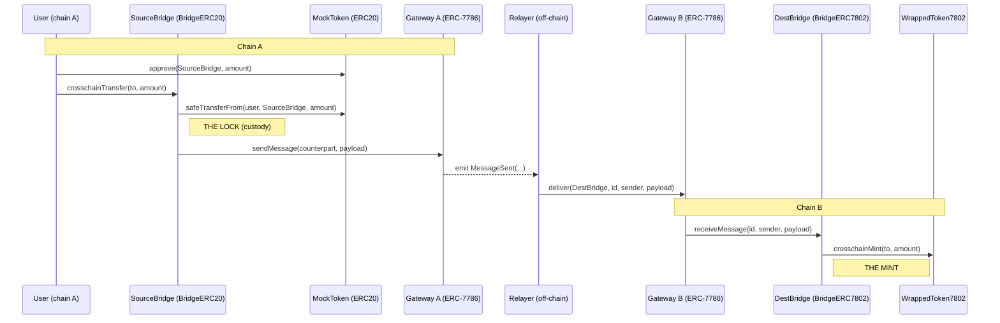

## Lock-and-mint flow

The token is locked (taken into custody) by the source bridge on chain A, a message is
carried across by an ERC-7786 gateway on each chain, and the destination bridge mints the
equivalent ERC-7802 token on chain B. The gateways are separate contracts on separate
chains: chain A's gateway only sends, chain B's gateway only delivers. The off-chain
relayer is the transport between them.

# Deployed contracts

## OP Sepolia

- ERC7786Gateway: 0xc7c73674aa1B32c82580f8FA0Ae65325d719C32b
- ERC20ForLock: 0x83D94B802F5D9c7EeF56fC6c0E92eeBB11cf83C9
- LockBridge: 0x645616D46EB1eCebC1AB1c9927192867DE0DC28C

## Base Sepolia

- ERC7786Gateway: 0xE3474E4bC25B7f94c43d81Ea383722074cE3277f
- ERC7802Token: 0x241Fb2FF9eDe4b68f9DeF8DC8e9AdE52D75Dc8e7
- MintBridge: 0x50d5539282846118B081E3917A9466a4E0e6A0c9

# Package managers

- **soldeer** manages on-chain Solidity dependencies (OpenZeppelin, forge-std) that get compiled and deployed — pinned in `foundry.toml` / `soldeer.lock`.
- **pnpm** manages off-chain JS dev tooling only (solhint); run `pnpm install` then `pnpm lint`.
