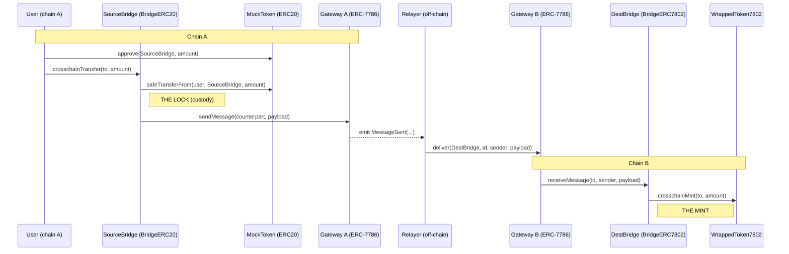

# Contracts

- **soldeer** manages on-chain Solidity dependencies (OpenZeppelin, forge-std) that get compiled and deployed — pinned in `foundry.toml` / `soldeer.lock`.
- **pnpm** manages off-chain JS dev tooling only (solhint); run `pnpm install` then `pnpm lint`.

## Lock-and-mint flow

The token is locked (taken into custody) by the source bridge on chain A, a message is
carried across by an ERC-7786 gateway on each chain, and the destination bridge mints the
equivalent ERC-7802 token on chain B. The gateways are separate contracts on separate
chains: chain A's gateway only sends, chain B's gateway only delivers. The off-chain
relayer is the transport between them.

