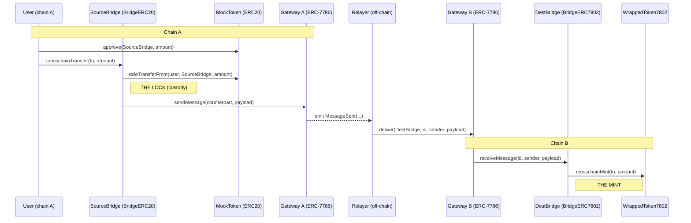

## Lock-and-mint flow

The token is locked (taken into custody) by the source bridge on chain A, a message is
carried across by an ERC-7786 gateway on each chain, and the destination bridge mints the
equivalent ERC-7802 token on chain B. The gateways are separate contracts on separate
chains: chain A's gateway only sends, chain B's gateway only delivers. The off-chain
relayer is the transport between them.

# Deployed contracts

## OP Sepolia

- ERC7786Gateway: 0xf84a8Fe4690361f8AFd67c3A81035cB1Fc6ca9f6
- ERC20ForLock: 0xE0C064077B513AfC0858287D75D3721cCf626C2e
- LockBridge: 0xdF6E6dE9bD34d9c95FE4681CAF320D00b1314cB3

## Base Sepolia

- ERC7786Gateway: 0x9092906fBC5778C8D43599188B8F5c7bb983d193
- ERC7802Token: 0x191Fbac34DF27F9B41baa94d9206067b494F7BEd
- MintBridge: 0xb5cBBFbb3b6AA7FD57732Fb2a50C4577d7D0D22d

# Package managers

- **soldeer** manages on-chain Solidity dependencies (OpenZeppelin, forge-std) that get compiled and deployed — pinned in `foundry.toml` / `soldeer.lock`.
- **pnpm** manages off-chain JS dev tooling only (solhint); run `pnpm install` then `pnpm lint`.
